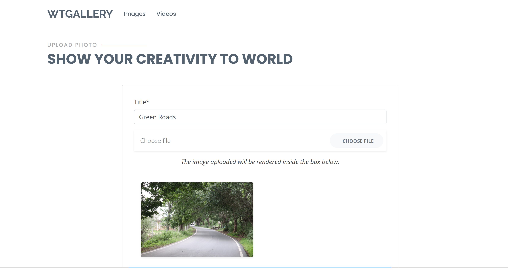

# Django wtGallery

Object Photo Video Gallery & Free Downloads.


For required libraries we added requirements.txt file in this project, you just to follow this command.

```
pip install -r requirements.txt

```

Run some command for running the Project:

```
1. python manage.py makemigrations

```
```
2. python manage.py migrate

```
```
3. python manage.py runserver

```


# To create user 

`python manage.py createsuperuser`


# To install nudepy

`pip install nudepy`





